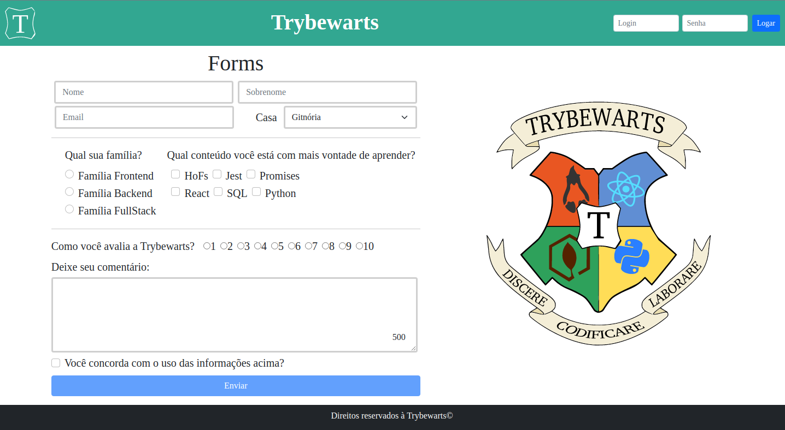

# Projeto Trybewarts

[Site no ar](https://dogl4.github.io/trybewarts/index.html)

## Descrição

Este projeto trata-se de um formulário bem simples, que simula um envio pelo método POST.

**Técnologias usadas**

> HTML, CSS, JavaScript e Bootstrap.

**Ajustes e melhorias**

O projeto foi um aprendizado a usar tag html e interações com javaScript.

## Requerimentos para rodar localmente

Antes de começar, verifique se você atendeu aos seguintes requisitos:

- Baixe o [Visual Studio Code](https://code.visualstudio.com/Download) e instale a extensão Live Share.

## Instalando Trybewarts

Para baixar o Trybewarts, siga estas etapas:

- Vá para a pasta onde quer baixar o projeto e digite no terminal: pelo HTTPS `https://github.com/Dogl4/trybewarts.git` ou pelo SSH`git@github.com:Dogl4/trybewarts.git`.

- Abra o projeto a pasta raiz do projeto com o VSC e no canto inferior click em 'Go Live'.

## Colaboradores

Estas pessoas participaram deste projeto:

<table>
  <tr  style="width:120px">
    <td align="center">
      <a target=”_blank” href="https://github.com/Dogl4">
         
        
          <b>Pedro Barreto</b>
        
      </a>
    </td>
    <td align="center">
      <a target=”_blank” href="https://github.com/Vincenzofdg">
         
        
          <b>Vincenzo G.</b>
        
      </a>
    </td>
    <td align="center">
      <a target=”_blank” href="https://github.com/betrybe">
         
        
          <b>Trybe</b>
        
      </a>
    </td>
  </tr>
  <td width="120px;">
    HTML/CSS.
  </td>

  <td width="120px;">
    JavaScript.
  </td>

  <td width="120px;">
    Ideia.
  </td>
  </th>
</table>
