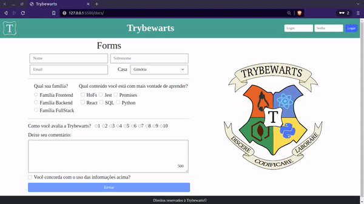

# Projeto Trybewarts

  ## 📷 Screenshot
  

## 📋 Descrição do projeto

Um projeto bem simples, que simula um envio de formulário. 

## 💻 Tecnologias utilizadas
- HTML
- CSS
- JavaScript
- Bootsctrap

##  :inbox_tray: Para rodar este projeto
- Para baixar este projeto via git rode no terminal: `git clone git@github.com:Dogl4/trybewarts.git` ou baixe .zipado [aqui](https://github.com/Dogl4/trybewarts/archive/refs/heads/main.zip)
- Use a extensão Live Share do [Visual Studio Code](https://code.visualstudio.com/Download).  Abra o projet com o VSC e clicke em: `Go Live `, no canto inferior direito. Acessa a pasta `/docs`
 
## 📈 Status do projeto

✅ Concluído

## 🚀 Links

- Site no ar: [Link](https://dogl4.github.io/trybewarts/index.html) 

## :busts_in_silhouette: Contribuintes

Estas pessoas participaram deste projeto:

<table>

<tr  style="width:120px">

<td  align="center">

<a  target=”_blank”  href="https://github.com/Dogl4">

 

<b>Pedro Barreto</b>

</a>

</td>

<td  align="center">

<a  target=”_blank”  href="https://github.com/Vincenzofdg">

 

<b>Vincenzo G.</b>

</a>

</td>

<td  align="center">

<a  target=”_blank”  href="https://github.com/betrybe">

 

<b>Trybe</b>

</a>

</td>

</tr>

<td  width="120px;">

HTML/CSS.

</td>

  

<td  width="120px;">

JavaScript.

</td>

  

<td  width="120px;">

Ideia.

</td>

</th>

</table>

